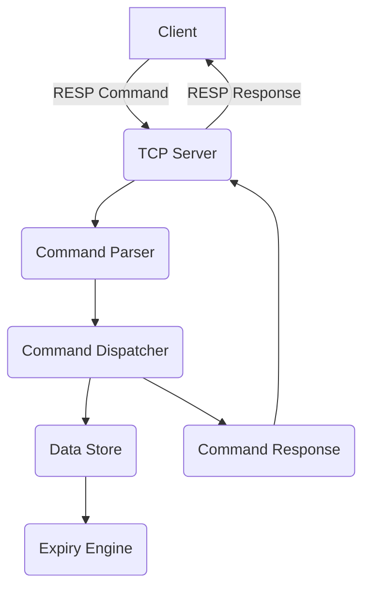

# NekoDB Architecture

## Overview

NekoDB is a lightweight, in-memory key-value datastore designed for simplicity and compatibility with Redis clients. It is implemented in Go, supporting basic Redis commands, concurrent client handling, key expiration, and periodic cleanup. This document provides an architectural overview of the major components and design principles of NekoDB.

---

## High-Level Components

### 1. TCP Server

- **Purpose:** Listens for incoming client connections on a specified port (default: 6379).
- **Protocol:** Implements the Redis Serialization Protocol (RESP) for communication.
- **Concurrency:** Spawns a separate goroutine for each client connection, enabling multiple simultaneous clients.

### 2. Command Parser & Dispatcher

- **RESP Parsing:** Decodes incoming RESP messages into commands and arguments.
- **Dispatcher:** Routes parsed commands to the appropriate handler functions.
- **Error Handling:** Sends protocol-compliant error messages back to clients for invalid or unsupported commands.

### 3. Data Store

- **Storage:** Maintains key-value pairs in Go’s native map structures, providing fast in-memory access.
- **Data Types:** Supports Strings, Lists, and Sets. Each type is implemented with a corresponding Go data structure.
- **Thread Safety:** Uses mutexes or sync primitives to ensure safe concurrent access.

### 4. Expiry & Cleanup Engine

- **Key Expiry:** Tracks expiration time for each key using timestamp metadata.
- **Automatic Cleanup:** A background goroutine periodically scans for expired keys and removes them.
- **Manual Expiry:** Supports explicit expiration commands (e.g., EXPIRE).

### 5. Command Handlers

- **SET/GET/DEL:** Basic key-value operations.
- **LPUSH/RPUSH/LLEN:** List operations mapped to Go slices.
- **SADD/SMEMBERS/SREM:** Set operations mapped to Go maps or sets.
- **EXPIRE/TTL:** Expiration management.

---

## Data Flow

1. **Client sends command →**
2. **TCP Server receives message →**
3. **RESP Parser decodes command →**
4. **Dispatcher routes to handler →**
5. **Handler interacts with Data Store →**
6. **(Optional) Expiry Engine updates metadata →**
7. **Handler returns response via TCP Server**

---

## Scalability & Limitations

- **Single Node:** NekoDB is designed for single-node, in-memory operation; it does not support clustering or persistence.
- **Memory Bound:** All data is stored in RAM; capacity is limited by available system memory.
- **No Persistence:** Data is lost on shutdown or crash.

---

## Extending NekoDB

- **New Commands:** Add handler functions and update the dispatcher.
- **New Data Types:** Implement data type logic and integrate with storage and parser.
- **Persistence:** Future improvements may include snapshotting or AOF-style persistence.

---

## Diagram

---

## References

- [Redis Protocol Specification](https://redis.io/docs/reference/protocol-spec/)
- [Go net package](https://pkg.go.dev/net)

---

For implementation details, see source code or [COMMANDS.md](./COMMANDS.md).
